= Workshop Swagger et OpenAPI 

Philippe Bousquet <pbousquet@sqli.com>

== Introduction

Aujourd'hui les APIs ont envahie le monde...

=== Qu'est ce qu'une API ?

Une API (pour Application Programming Interface) est un ensemble normalisé de classes, de méthodes, de fonctions et de constantes qui sert de façade par laquelle un logiciel offre des services à d'autres logiciels. _(https://fr.wikipedia.org/wiki/Interface_de_programmation[Wikipedia])_

=== Spécifications ?

L'API est offerte par une bibliothèque logicielle ou un service web, le plus souvent accompagnée d'une description qui spécifie comment des programmes consommateurs peuvent se servir des fonctionnalités du programme fournisseur. _(https://fr.wikipedia.org/wiki/Interface_de_programmation[Wikipedia])_

=== Swagger / OpenAPI

La spécification OpenAPI (OAS) définit une description d'interface standard indépendante du langage de programmation pour les API REST, qui permet aux humains et aux ordinateurs de découvrir et de comprendre les capacités d'un service sans avoir besoin d'accéder au code source, à la documentation supplémentaire ou à l'inspection du trafic réseau. _(http://spec.openapis.org/oas/v3.0.3[OpenAPI])_

=== Versions

[format="csv", separator=";" options="autowidth"]
|===
*Version*; *Date*; *Notes*
1.0; 	2011-08-10; 	First release of the Swagger Specification
2.0; 	2014-09-08; 	Release of Swagger 2.0
2.0; 	2015-12-31; 	Donation of Swagger 2.0 to the OpenAPI Initiative
3.0.0; 	2017-07-26; 	Release of the OpenAPI Specification 3.0.0
3.1.0; 	2021-02-05; 	Last release of the OpenAPI Specification 3.1.0
|===

=== Références

* Le site d'OpenApi : https://www.openapis.org/
* Les spécifications : http://spec.openapis.org/oas/v3.0.3 

== Level 0 : Tester mon API via Postman

A l'époque des dinosaures...

https://github.com/darken33/ws-swagger-openapi/tree/main/demo/0-postman[Démo sous Git] 

=== Étape 1 : On développe notre API 1/2

[source, java]
----
package com.sqli.pbousquet.testapi.api;

[...]

@RestController
@RequestMapping({"/api/v1/hello"})
public class HelloAPI {

    private static final Logger LOGGER = LoggerFactory.getLogger(HelloAPI.class);

    @GetMapping
    public ResponseEntity<HelloDto> hello() {
        LOGGER.info("GET /api/v1/hello");
        return hello(null);
    }

    @GetMapping(path = "/{name}")
    public ResponseEntity<HelloDto> hello(@PathVariable String name) {
        if (name != null) LOGGER.info("GET /api/v1/hello/"+name);
        HelloDto result = new HelloDto();
        result.setMessage("Hello World");
        if (name != null) {
            if ("123".equals(name)) {
                return ResponseEntity.badRequest().build();
            }
            result.setMessage("Hello " + name);
        }
        LOGGER.info("Response : "+result.getMessage());
        return ResponseEntity.ok(result);
    }
}
----

[.notes]
--
Ici le developpeur a défini deux APIs : 

* GET http://monserveur:monport/api/v1/hello : qui renverra "Hello World" 
* GET http://monserveur:monport/api/v1/hello/{name} : qui renverra "Hello {name}" 
--

=== Étape 2 : On compile, on exécute, on teste ????

http://localhost:8080/api/v1/hello

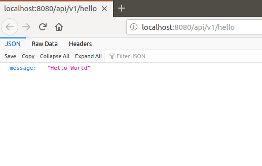

[%step]
* Comment tester une API en POST, PUT ou DELETE ?

[.notes]
--
* Par chance mon API est en *GET*, donc dans mon navigateur j'arrive à avoir mon résultat en tappant l'url http://localhost:8080/api/v1/hello
* Mais comment tester les APIs en POST, PUT ou DELETE ?
--

=== Étape 3 : Postman à la rescousse

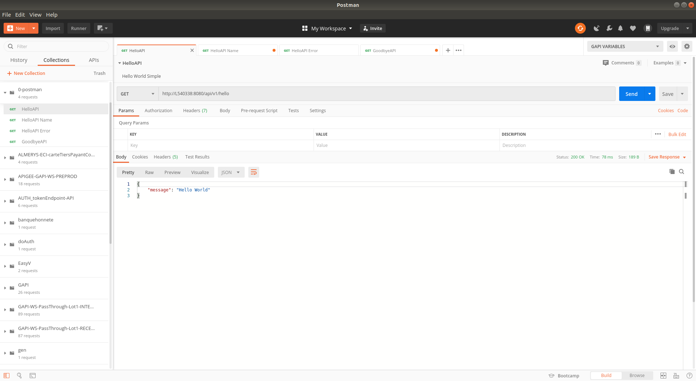

[.notes]
--
Postman est un outil permettant d'appeler des APIs (il existe d'autres outils, comme SOAP-UI).
--

=== Problématique : Communiquer aux autres

Les consommateurs doivent connaitre : 

[%step]
* Les URIs exposées
* Les Verbes à utiliser
* Les paramètres
* ...

[.notes]
--
* Maintenant, pour que d'autres puissent utiliser mon API il faut que je leur explique comment s'en servir. 
* Généralement ceci était décrit dans un document Word (par exemple), mais les erreurs sont possibles (faute de frappe), et lorsqu'on fait évoluer l'API il faut penser à mettre à jour le document.
--

== Level 1 : Tester mon API via Swagger

Offrir une UI pour tester les APIs (mais pas que)

https://github.com/darken33/ws-swagger-openapi/tree/main/demo/1-swagger[Démo sous Git] 

=== Étape 1 : Réferencer les dépendances swagger

_Fichier pom.xml :_
[source, xml]
----
	<dependencies>
    [...]
		<dependency>
			<groupId>io.springfox</groupId>
			<artifactId>springfox-swagger2</artifactId>
			<version>2.9.2</version>
		</dependency>
		<dependency>
			<groupId>io.springfox</groupId>
			<artifactId>springfox-swagger-common</artifactId>
			<version>2.9.2</version>
		</dependency>
		<dependency>
			<groupId>io.springfox</groupId>
			<artifactId>springfox-swagger-ui</artifactId>
			<version>2.9.2</version>
		</dependency>
		<dependency>
			<groupId>io.springfox</groupId>
			<artifactId>springfox-bean-validators</artifactId>
			<version>2.9.2</version>
		</dependency>
	</dependencies>
----

[.notes]
--
* On ajoute les dépendences springfox dans notre POM
* À noter qu'aujourd'hui nous préfèrerons springdoc 
--

=== Étape 2 : Configurer mon application

_Fichier SwaggerConfig.java :_ 
[source, java]
----
package com.sqli.pbousquet.testapi.config;

[...]

@Configuration
@EnableSwagger2
public class SwaggerConfig {
    
    [...]

    @Bean
    public Docket api(ServletContext servletContext) {
        return new Docket(DocumentationType.SPRING_WEB)
                .pathProvider(new RelativePathProvider(servletContext) {
                    @Override
                    public String getApplicationBasePath() {
                        return basePath;
                    }
                })
                .apiInfo(DEFAULT_API_INFO)
                .produces(DEFAULT_PRODUCES_AND_CONSUMES)
                .consumes(DEFAULT_PRODUCES_AND_CONSUMES)
                .select().paths(PathSelectors.ant("/api/**")).build();
    }

}
----

[.notes]
--
* On ajoute un peu de configuration pour générer la page swagger-ui.
--

=== Étape 3 : On compile, on exécute, on teste

http://localhost:8080/swagger-ui.html

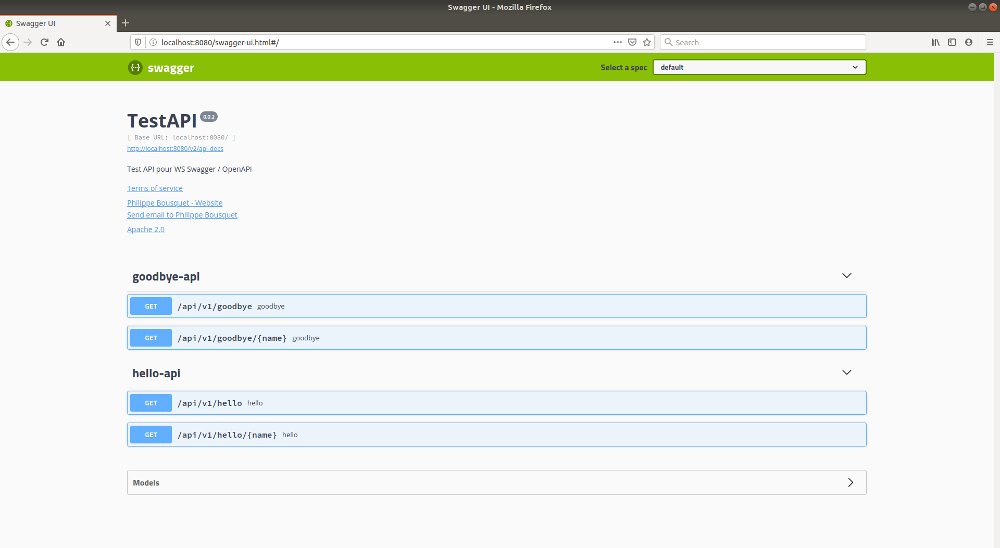

[.notes]
--
* Swagger nous propose une simple interface, nous permettant de tester nos APIs.
--

=== Le petit plus : les spécifications

http://localhost:8080/v2/api-docs

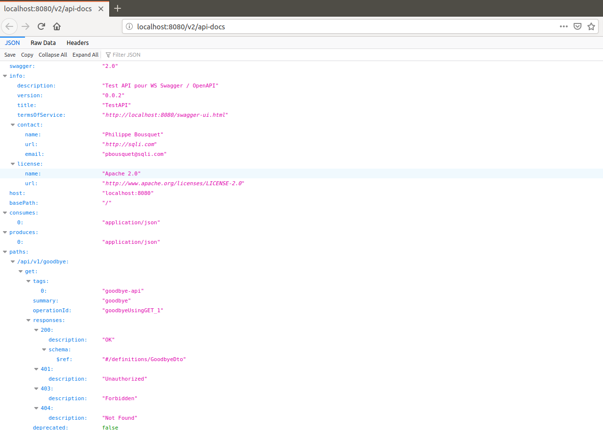

[.notes]
--
L'autre avantage réside dans le fait qu'il est posible de récupérer les spécifications de nos APIs suivant la norme Swagger 2.0 (voire OpenAPI 3.0) au format Json.
--

== Level 2 : Documenter avec les Annotations

Des annotations pour de la documentation enrichie...

https://github.com/darken33/ws-swagger-openapi/tree/main/demo/2-annotations[Démo sous Git] 

=== Étape 1 : Modifier la conf SwaggerConfig

[source, java]
----
    @Bean
    public Docket api(ServletContext servletContext) {
        return new Docket(DocumentationType.SWAGGER_2)
                .pathProvider(new RelativePathProvider(servletContext) {
                    @Override
                    public String getApplicationBasePath() {
                        return basePath;
                    }
                })
                .apiInfo(DEFAULT_API_INFO)
                .produces(DEFAULT_PRODUCES_AND_CONSUMES)
                .consumes(DEFAULT_PRODUCES_AND_CONSUMES)
                .select().paths(PathSelectors.ant("/api/**")).build();
    }
----

IMPORTANT: Assurez vous d'avoir sélectionné _DocumentationType.SWAGGER_2_

=== Étape 2 : Ajouter des annotation sur vos API

[source, java]
----
    @GetMapping(path = "/{name}")
    @ApiOperation(value = "Saluer une personne en particulier", 
        response = HelloDto.class, position = 1)
    @ApiResponses({
            @ApiResponse(code = 200, message = "OK"),
            @ApiResponse(code = 400, message = "Mauvaise requête, 
                123 n'est pas une valeurs valide")
    })
    public ResponseEntity<HelloDto> hello(@ApiParam(required = true, 
        name = "name", value = "Nom de la personne à saluer") 
        @PathVariable String name) {

        if (name != null) LOGGER.info("GET /api/v1/hello/"+name);
        HelloDto result = new HelloDto();
[...]
    }
----

=== Étape 3 : On compile, on exécute, on teste

http://localhost:8080/swagger-ui.html

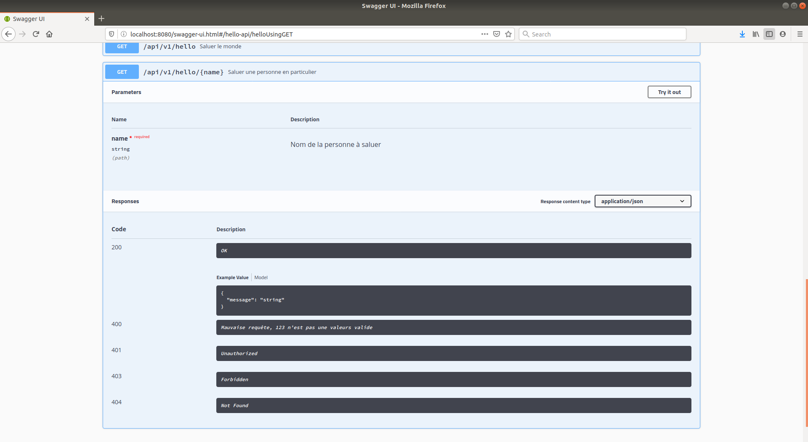

[.notes]
--
* Nous pouvons remarquer que les annotations sont reportées sur l'interface.
--

=== Beaucoup d'annotations disponibles

package io.swagger.annotations.* :

[%step]
* Api
* ApiOperation
* ApiResponse
* ApiParam
* ...

== Level 3 : SwaggerHub, définir et générer mon API

Pemiers pas vers la génération de code... 

https://github.com/darken33/ws-swagger-openapi/tree/main/demo/3-swaggerhub[Démo sous Git] 

=== Étape 1 : Décrire son API dans SwaggerHub

https://app.swaggerhub.com/home

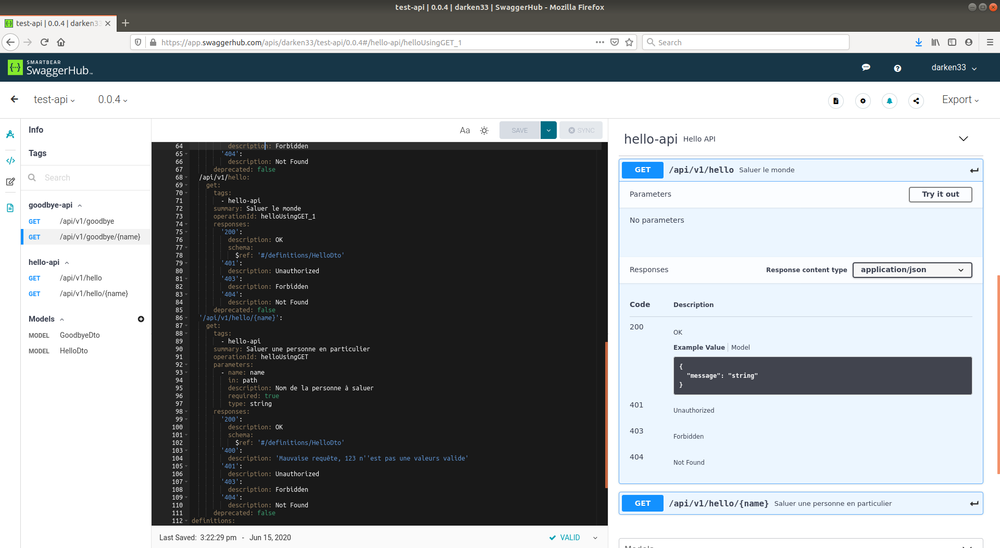

IMPORTANT: Ne pas utiliser cette solution en dehors de POC 

[.notes]
--
* Il est possible de définir ou importer des spécifications d'APIs dans une solution SaaS.
--

=== Étape 2 : Générer le code (Server / Client)

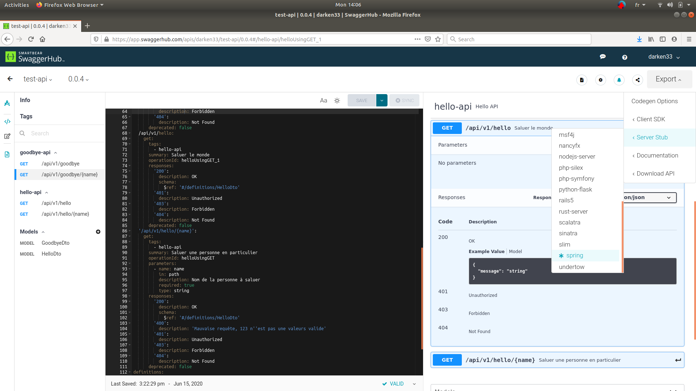

[.notes]
--
L'UI nous permet de générer des serveurs et clients pour divers langages (PHP, NodeJs, Python, Spring, JaxRs, ...)
--

=== Étape 3 : Implémenter le code

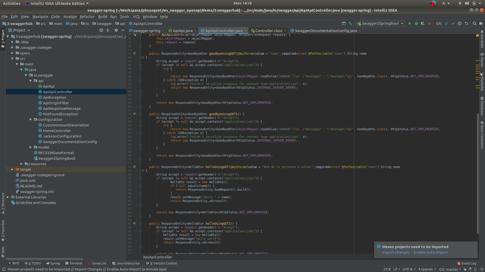

[.notes]
--
Il suffit alors dans son IDE d'implémenter le corps des méthodes...
--

=== Étape 4 : On compile, on exécute, on teste

http://localhost:8080/swagger-ui.html

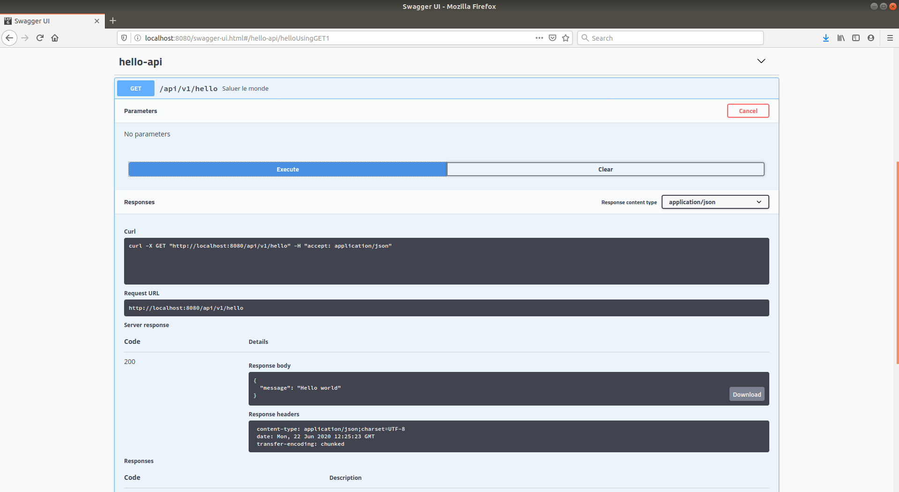

=== Mais solution à éviter

[%step]
* La définition des API est stockée sur le net
* Le code généré n'est pas très gracieux
* Mélange entre génération et implémentation manuelle
* versions des dépendances figées dans le pom.xml

=== Alternative : plugin OpenAPIGenerator

Il existe un plugin pour IntelliJ : 

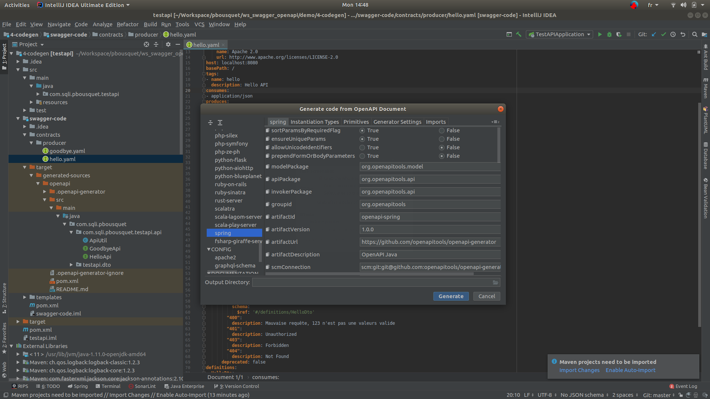

[.notes]
--
Permet d'éviter de stocker la définition de son API sur SwaggerHub
--

== Level 4 : Définir et générer mon API (Maven, non intrusif)

Aller plus loin dans la génération de code... 

https://github.com/darken33/ws-swagger-openapi/tree/main/demo/4-codegen[Démo sous Git] 

=== Les premiers pas du Design First chez un Client

*Plugin Maven :* openapi-generator-maven-plugin

[source, xml]
----
<plugin>
    <groupId>org.openapitools</groupId>
    <artifactId>openapi-generator-maven-plugin</artifactId>
    <version>4.1.0</version>
    <executions>
[...]
    </executions>
</plugin>
----

[.notes]
--
* Nous avons poussé pour expérimenter le desgin d'API et la génération de code chez un Client, cependant nous ne voulions pas impacter l'ensemble du projet.
* Nous avons donc créé un projet autonome qui ne rentrait pas dans le processus de PIC, il était utilisé pour générer manuellement au treavers de maven le code correspondant aux spécifications de nos API.
--

=== Étape 1 : Designer l'API

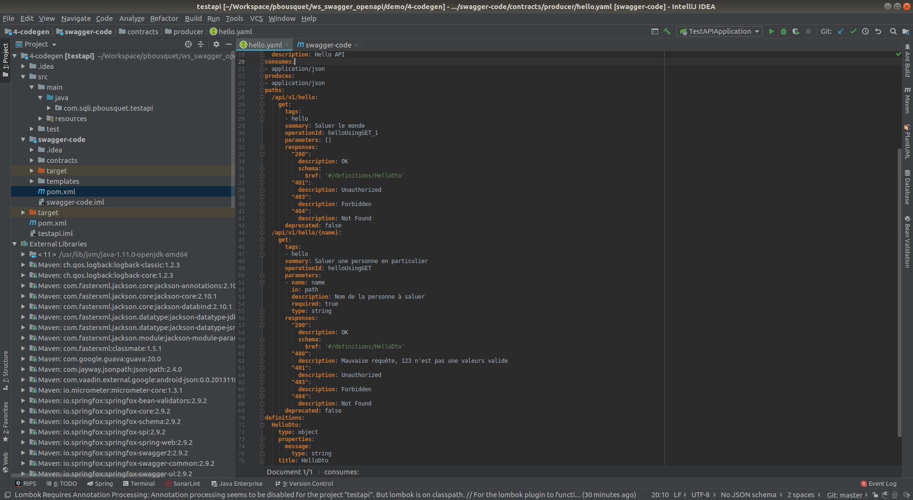

[.notes]
--
Au travers d'IntelliJ nous pouvons éditer des fichiers Yaml
--

=== Étape 2 : Prévisualiser l'API

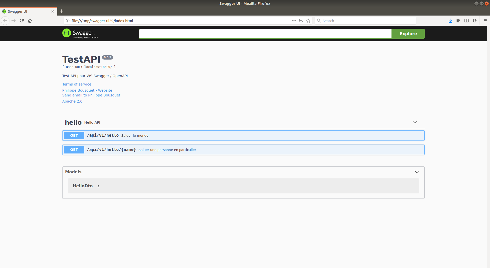

[.notes]
--
On peut également prévisiualiser le résultat dans le navigateur
--

=== Étape 3 : Générer le code de l'API

[source, xml]
----
<execution>
    <id>1</id>
    <goals>
        <goal>generate</goal>
    </goals>
    <configuration>
        <inputSpec>${project.basedir}/contracts/producer/hello.yaml</inputSpec>
        <generatorName>spring</generatorName>
        <library>spring-mvc</library>
        <templateDirectory>templates/producer/spring</templateDirectory>
        <generateApiTests>false</generateApiTests>
        <generateModelTests>false</generateModelTests>
        <generateSupportingFiles>true</generateSupportingFiles>
        <configOptions>
            <useTags>true</useTags>
            <sourceFolder>src/main/java</sourceFolder>
            <dateLibrary>java7</dateLibrary>
            <java8>true</java8>
            <interfaceOnly>true</interfaceOnly>
            <hideGenerationTimestamp>false</hideGenerationTimestamp>
        </configOptions>
        <apiPackage>com.sqli.pbousquet.testapi.api</apiPackage>
        <modelPackage>com.sqli.pbousquet.testapi.dto</modelPackage>
    </configuration>
</execution>
----

[.notes]
--
On définie une configuration par fichier YAML que l'on souhaite générer (dans le pom.xml) :
--

=== Étape 3 : Générer le code de l'API (2/2)

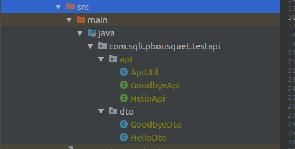

[.notes]
--
Le code généré (Interfaces des APIs, Dto, Classes utilitaires) se trouve alors noté en tant que Generated Source, et peut être déplacé dans le projet réel.
--

=== Étape 4 : Implémenter le code de l'API 

[source, java]
----
package com.sqli.pbousquet.testapi.api.impl;

import com.sqli.pbousquet.testapi.dto.HelloDto;
import io.swagger.annotations.Api;
import org.springframework.http.ResponseEntity;
import org.springframework.stereotype.Controller;
import org.springframework.web.bind.annotation.RestController;

@RestController
@Api(value = "Hello", description = "the Hello API", tags = {"hello"})
public class HelloApiImpl implements com.sqli.pbousquet.testapi.api.HelloApi {

    @Override
    public ResponseEntity<HelloDto> helloUsingGET1() {
        HelloDto result = new HelloDto();
        result.setMessage("Hello World");
        return ResponseEntity.ok(result);
    }

    @Override
    public ResponseEntity<HelloDto> helloUsingGET(String name) {
        HelloDto result = new HelloDto();
        result.setMessage("Hello "+name);
        return ResponseEntity.ok(result);
    }
}
----

[.notes]
--
On peut alors implémenter les classes HelloApiImpl et GoodbyeApiImpl.
--

=== Étape 5 : On compile, on exécute, on teste

http://localhost:8080/swagger-ui.html

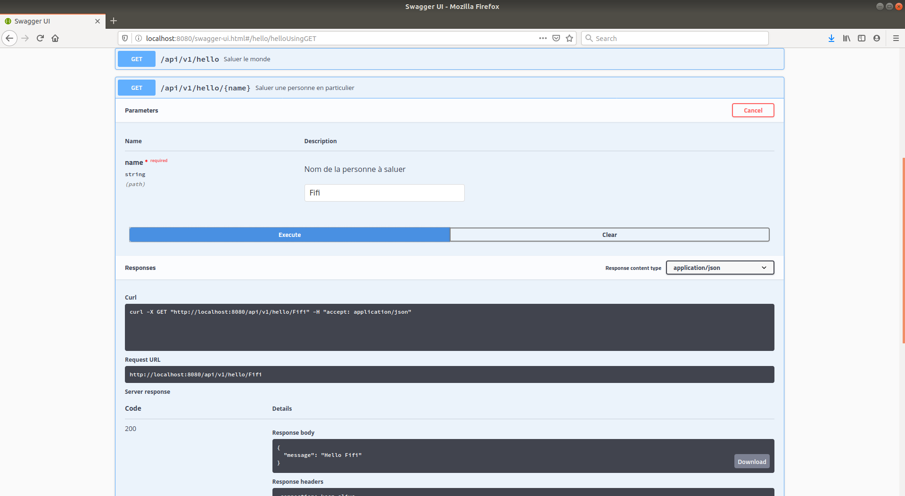

== Level 5 : Industrialisation

Génération totalement intégrée au cycle de dev...

https://gitlab.bordeaux.sqli.com/pbousquet/ws_swagger_openapi/-/tree/master/demo/5-codegen-plus[Démo sous Git]

=== Étape 1 : Intégrer la génération dans le projet 

IMPORTANT: Ne plus passer par un projet intermédiaire

[.notes]
--
* L'objectif ici n'est plus de générer le code, puis l'importer dans notre projet, mais de générer les sources directement dans la phase de build du projet.
* Il s'agit de l'étape suivante logique, une fois que la technique est suffisament éprouvée.
* On reprend les étapes (ajout du plugin et configuration maven) directement dans notre projet
-- 

=== Étape 2 : Génération du code dans le cycle de dev 

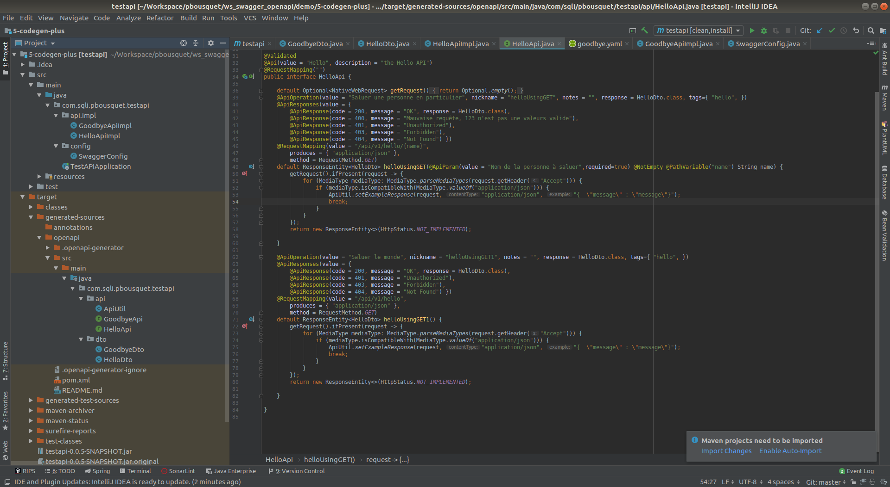

[.notes]
--
Le code généré (Interfaces des APIs, Dto, Classes utilitaires) se trouve alors noté en tant que Generated Source, directement dans le projet.
--

=== Étape 3 : On compile, on exécute, on teste

http://localhost:8080/swagger-ui.html

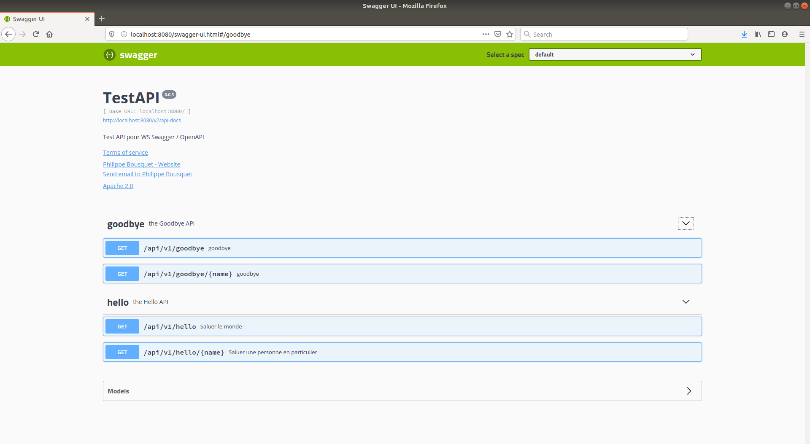

== Merci !

https://tinyurl.com/ws-swagger-openapi

*Gihtub :* @darken33
